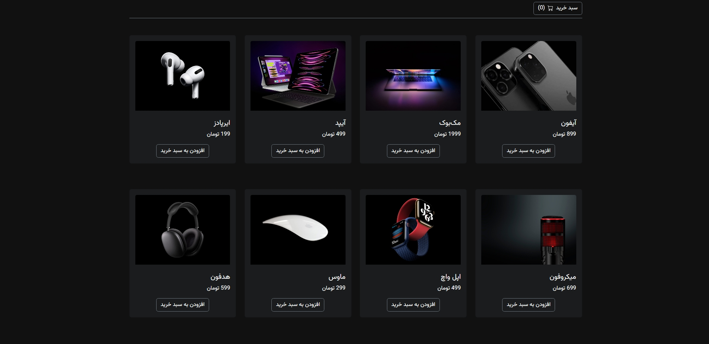

# 🛒 Shopping Cart – Modern React Cart App

A responsive and user-friendly shopping cart web application that delivers a smooth product management experience. Users can add, remove, and update product quantities, with real-time price calculations and a modern dark UI. This project demonstrates clean component-based architecture and efficient state management.

---

## 🚀 Features

- Product listing with image, title, and price  
- Add, remove, and update quantity in cart  
- Real-time total price calculation  
- Modern dark UI with smooth interactions  
- Clean and modular code structure  

---

## 💼 Skills Applied

- React component architecture  
- useReducer & Context API for state management  
- Dynamic and responsive UI  
- Event handling and data flow  
- Clean and scalable codebase  

---

## 📂 Project Structure

